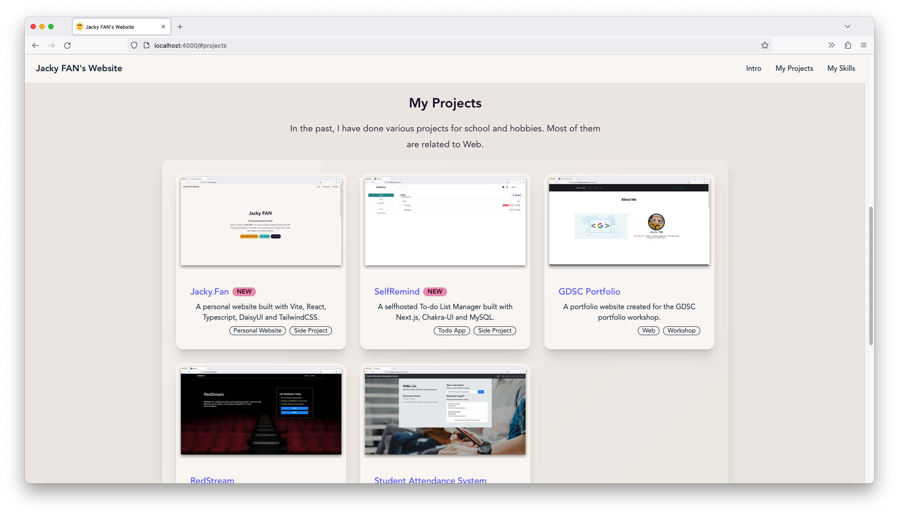
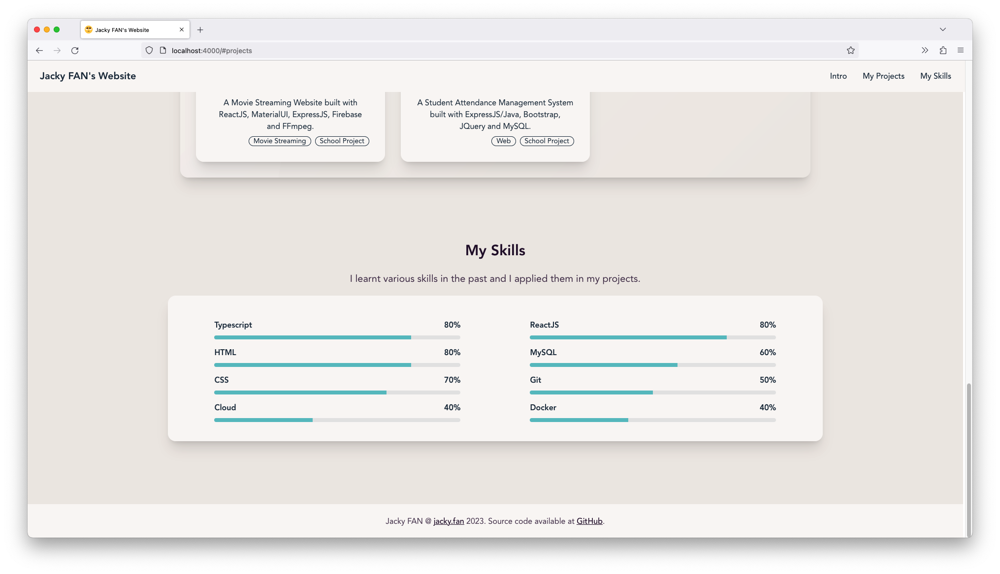

[](https://www.codefactor.io/repository/github/redfrogsss/jacky.fan)

You can access this website via https://jacky.fan

# [Jacky.Fan](https://jacky.fan) - My personal website
A personal website built with Vite, React, Typescript, DaisyUI and Tailwind CSS.

## Screenshots




## Getting Started with `Yarn`

Start `Dev` Server:

```bash
# Clone the repo
git clone https://github.com/redfrogsss/jacky.fan.git

# Install dependencies
cd jacky.fan
yarn

# Start dev server
yarn dev
```

## Learn More

This project uses the following tech:

- [React](https://reactjs.org/)
- [TypeScript](https://www.typescriptlang.org/)
- [Vite](https://vitejs.dev/)
- [Tailwind CSS](https://tailwindcss.com/)
- [DaisyUI](https://daisyui.com/)
- [HeroIcon](https://heroicons.com/)
- [Cloudflare Pages](https://pages.cloudflare.com/)