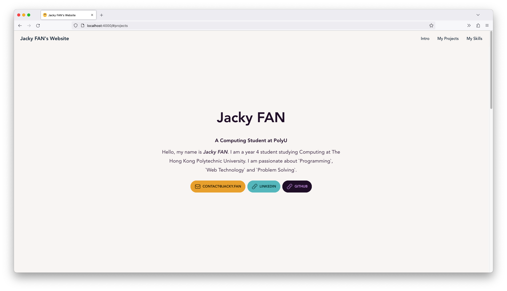

[](https://www.codefactor.io/repository/github/redfrogsss/jacky.fan)

You can access this website via https://jacky.fan

# [Jacky.Fan](https://jacky.fan) - My personal website
A personal website built with Vite, React, Typescript, DaisyUI and Tailwind CSS.

## Features
- Dark Mode Support
- Responsive UI
- etc.

## Screenshots



## Getting Started with `Yarn`

Start `Dev` Server:

```bash
# Clone the repo
git clone https://github.com/redfrogsss/jacky.fan.git

# Install dependencies
cd jacky.fan
yarn

# Start dev server
yarn dev
```

## Learn More

This project uses the following tech:

- [React](https://reactjs.org/) - A JavaScript library for building user interfaces
- [TypeScript](https://www.typescriptlang.org/) - A superset of JavaScript.
- [Vite](https://vitejs.dev/) - Next generation frontend tooling. It's fast!
- [Tailwind CSS](https://tailwindcss.com/) - A utility-first CSS framework for rapidly building custom designs.
- [DaisyUI](https://daisyui.com/) - A simple, responsive and customizable UI components library for Tailwind CSS.
- [HeroIcon](https://heroicons.com/) - Beautiful hand-crafted SVG icons.
- [Cloudflare Pages](https://pages.cloudflare.com/) - A static site hosting service.